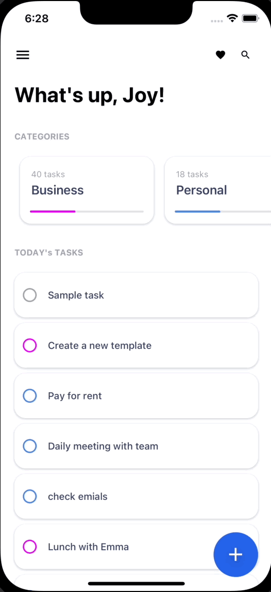

## Animated Todo App

### Simple Todo app with animations.

- Built using Expo, react-navigation, and react-native-reanimated

### Running the app

```sh
$ git clone https://https://github.com/chris24elias/Animated-todo.git

$ cd Animated-todo

$ yarn

ios:

$ yarn ios

android:

$ yarn android
```

# Demo

<p float="left">
  
   
</p>
